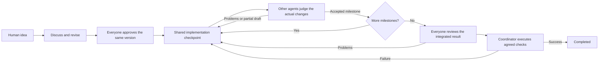

# agent-team

Start with an idea. Claude Code, Codex, and other agents discuss it in a shared conversation, reach explicit consensus, then build and judge each other's work. Humans can observe, contribute, interrupt, and redirect the team from a CLI.

Python 3.11+ on Linux, macOS, or WSL. Native Windows is not supported because process groups and workspace locks use POSIX interfaces.

## Quick start

```bash
uv sync
uv run agent-team demo
```

The deterministic demo needs no accounts. Its equally responsible members are named `member_a` and `member_b`. Enter an idea to watch proposal, unanimous agreement, shared implementation, immediate peer judgments, integration review, and actual acceptance checks. It builds a fixed greeting example, regardless of the idea. Files and history live in a disposable temporary workspace, removed on exit.

For real work, install and sign in to both `claude` and `codex`. Set `workspace` in [team.toml](team.toml) to the project you want the team to modify, then run:

```bash
uv run agent-team doctor
uv run agent-team start
```

Once all agents agree, build mode automatically allows implementation and executes the agreed checks. No extra human approval step is required. Calls use each CLI's local authentication and account quota; omitted models use the CLI defaults. `doctor` checks configuration and executables, not account access or quota.

The checked-in configuration and `init` template select `interaction_mode = "chatroom"` and `permission_mode = "full_auto"`. Members think concurrently and publish independently. An assigned Codex writer has full access; other Codex turns are read-only. Claude Code uses auto mode with a host-side tool guard for non-writing turns. Use only with a trusted workspace and review the [operational boundaries](#permissions-and-operational-boundaries).

Another terminal can join:

```bash
uv run agent-team join --name observer
```

The default session directory is `.agent-team/default` under your current directory. From elsewhere, supply its absolute path with `--session /path/to/.agent-team/default`.

`start` runs the server and your terminal together; leaving stops that server and disconnects its clients, but retains history. For unattended work, run the server independently and participate through `join`:

```bash
# Terminal 1
uv run agent-team serve
# Terminal 2
uv run agent-team join
```

Leaving `join` (including `/quit`, Ctrl-D, or a connection loss) does not pause or interrupt the team, even when no humans remain online. Discussion, implementation, peer judgment, and acceptance checks continue; reconnect with `join` to see the current state and all committed history. Keep the `serve` process running: it is a foreground server, not a detached daemon. Stopping it with Ctrl-C or SIGTERM shuts down the room and cancels active work.

Use `agent-team init` to create a configuration in a new directory.

## How collaboration works



This is shared authorship, not a set of private coding assignments. Every agent can modify another agent's implementation within the agreed scope. Tasks describe shared milestones and dependencies; an optional `owner` in older proposals is a suggestion, never an access restriction.

All agents receive the same core responsibilities: think independently, discuss goals and architecture, propose and challenge plans, implement shared work, and critically review and verify peer changes. Names and backends do not imply fixed specialties, seniority, or exclusive assignments. Who implements or judges changes with the workflow and current contribution, not a permanent model-specific role.

Implementation alternates with judgment throughout the build:

1. An agent submits a versioned checkpoint, including files, reasoning, and actual test results. A checkpoint may be a partial draft.
2. Every other agent must inspect and judge that revision. Its author cannot self-approve. A rejection carries concrete evidence and reopens the milestone.
3. The critic can take the next write turn and demonstrate a fix. The previous author then judges the revision. Writer turns rotate between agents; humans can choose another eligible writer with `/next`.
4. Only a ready checkpoint accepted by all peers completes a milestone and releases its dependencies.

A final all-member integration review catches interactions between milestones and changes made after earlier checkpoints. Review failures reopen the affected tasks and downstream dependencies. Only the coordinator can mark the project completed, after all declared acceptance commands actually exit successfully. Passing those checks establishes the agreed checks passed, not that every possible defect is absent.

Speaking and writing are separate. In chatroom mode, each member has a resident worker and an independent private connection. Discussion and eligible peer/integration reviews run concurrently. Members publish as they finish, without round-robin speaking turns or cancelling slower peers. The server orders committed messages; the CLI keeps simultaneous drafts in separate buffers.

Only one implementation or acceptance-check turn holds the workspace write lease. Formal readers finish before the next writer begins; conversation-only turns can continue while implementation runs but cannot vote, judge, or write files. All approvals must refer to the current proposal/checkpoint generation. Stale concurrent actions are recorded as rejected, not applied or silently counted. Unanimous discussion waits for in-flight formal discussion to finish so a pending objection cannot race with the first write.

New messages are broadcast to clients immediately and retained for every member. Busy agents consume accumulated messages at their next input boundary; this version does not inject public messages into an in-flight model generation or claim token-by-token shared awareness. An agent's own publication alone does not trigger another model call unless workflow progress requires one. With nothing new to contribute, members yield and listen for new events instead of polling models. There are no permanent model-specific roles.

Set `interaction_mode = "serial"` for the previous single-floor scheduler. Configurations that omit this key retain serial behavior; the checked-in configuration, `init` template, and interactive `demo` use chatroom mode.

## No round or output limits

The application imposes no conversation-round budget, output-length limit, message-length limit, or shared-context character limit. It does not truncate prompts, public messages, terminal history, CLI error diagnostics, or acceptance-check output. Large JSONL frames are read incrementally without a fixed frame-length cap. Joining replays the complete committed conversation.

There is no automatic stop after a number of rounds or repair attempts. Work continues until completion, a user pause, or an explicit blocker. In chatroom mode, a failed member is isolated while healthy members continue; mandatory votes are never waived. If everyone has nothing new to add, workers remain listening for new messages. Yielding is not consensus. Serial mode retains its whole-room pause on error or all-member yield.

Provider context windows, provider output limits, local CLI settings, available memory/disk, and account quota still apply. Public history is retained in full. Session mode sends new public messages after the first invocation, while the backend maintains a growing private context and may compact it. Incremental delivery does not guarantee lower model-token cost. This project does not bypass provider limits or silently summarize the public record.

Hard timeouts are disabled by default for discussion, implementation, peer judgment, integration review, and acceptance checks. Work can continue until completion or a user interruption. Set a timeout to a positive number of seconds only if you want an explicit total-duration limit; it can terminate an otherwise active process. Existing configurations with positive timeouts keep those limits; set them to `0` to remove them. `/next` intentionally executes one turn because the user requested a single step; it is not a conversation budget.

After 120 seconds without observable output, the terminal shows a waiting notice, without cancelling the process, pausing the room, revoking the floor, or invalidating its private session. Each continuous silent period produces one notice; new output rearms it. Native CLI stdout (including tool events and partial JSON frames), stderr, and acceptance-command output all count as activity, without publishing private reasoning or diagnostics. Silence is not proof of a hang: a model or tool can be busy without producing output. Use `/interrupt` to cancel, or set `idle_warning_seconds = 0` to disable these notices.

## Participate from the CLI

Type ordinary text to speak; humans do not need the floor. The terminal separates committed history from the live reply, while keeping the input editable. PgUp/PgDn scroll history; Tab completes commands.

| Command | Effect |
| --- | --- |
| `/pause` | Finish all active replies, then pause |
| `/interrupt` or Ctrl-C | Cancel all active turns and their process groups, then pause |
| `/resume` | Continue automatically without a round budget |
| `/retry [agent]` | In chatroom mode, retry one unavailable member or all members; no silent retry loop |
| `/redirect text` | Revoke active turns and reopen planning with explicit new guidance |
| `/next [agent]` | Advance one eligible agent turn; authors cannot judge themselves |
| `/status` | Show phase, active thinkers, writer, runtime failures, and turn count |
| `/sessions` | Show private session IDs, acknowledged public-message cursors, and uncertain turns |
| `/reset-session [agent]` | While idle, discard one or all private-session references and pause; preserve public history and files |
| `/plan`, `/tasks` | Show consensus, shared milestones, contribution revisions, judgments, and checks |
| `/history [id]` | Read a page of 100 messages after an event ID; paging does not truncate messages |
| `/quit` or Ctrl-D | Leave this terminal |

In chatroom mode, ordinary human messages add context without cancelling work or resetting an agreed plan. Use `/redirect text` to change direction explicitly. New guidance after completion or an explicit blocker starts planning again. Serial mode still treats every human message as a redirect. Interrupted replies are not committed, but existing file changes remain: no automatic rollback. Agents are instructed to inspect interrupted work before continuing.

Manual pauses and recovery require `/resume`. In chatroom mode, `/retry agent` clears that member's failure; `/resume` also retries unavailable members. A quota failure does not cancel healthy members, but a plan or review requiring the unavailable member cannot reach unanimity until it returns. No quota-reset time is guessed. Human presence does not control scheduling: disconnecting does not pause, and reconnecting does not resume a paused room. Explicit `/pause` and `/interrupt` still take effect when everyone subsequently leaves.

## Shared context and recovery

SQLite stores ordered public messages and floor events. A reply, its workflow snapshot, and the agent's acknowledged session cursor are committed in one transaction. The public record is the authority; private sessions are disposable working memory.

The default `context_mode = "session"` gives each Codex or Claude agent its own resumable session. Chatroom mode starts native processes lazily on first work and keeps them alive across successful turns: Codex uses the bidirectional `app-server` protocol; Claude uses streaming JSON input/output with the control protocol. Connections use the installed CLIs and their local authentication, not a replacement model API. Pausing or losing human clients does not close healthy connections. Cancellation, transport failure, explicit session replacement, or server shutdown can close them. Serial mode still starts a CLI process per turn.

The first invocation gets the full public transcript. Later invocations get missing public messages. In chatroom mode, the cursor advances only to the acknowledged input boundary; separately recorded own-message IDs avoid repeating the author's reply. It must not jump to the author's newly committed message ID, because concurrent peer messages before that ID might not have reached the author. Message, workflow, and session acknowledgements are committed atomically. Serial mode retains its reply-boundary cursor optimization.

Every turn also receives the shared responsibilities, any explicitly configured additional focus, current phase instructions, the current workflow, latest human guidance as an explicit reminder, and file paths reported changed since synchronization. Those paths are not an exhaustive filesystem diff: agents must re-read relevant files before editing or judging. Important decisions, findings, and test results must be published rather than kept only in private notes.

Set `context_mode = "full"` for the entire public transcript and a fresh, nonpersistent private conversation per invocation. Codex can create fresh threads within its resident server; Claude restarts its process in this explicit compatibility mode. Mock and custom command backends remain stateless and always receive full context. Their room workers are resident, but custom commands still run once per invocation. For a one-off fresh judgment, interrupt and wait for all active turns, then use `/reset-session agent-name` and `/next agent-name` with an eligible peer's name.

Shared public context does not mean identical private histories, system prompts, internal reasoning, or model caches. Native CLI compaction can change private memory; current team state is injected again on every turn.

Consensus requires explicit approval of the same proposal version by every member, including the proposer on a later turn. A new proposal clears votes; an objection revokes existing approvals. Ordinary textual agreement, silence, and `[[PASS]]` are not votes.

The same `--session` recovers history and state, initially paused. Clean private sessions resume their exact IDs after `/resume`; no `--last` or `--continue` lookup is used. Before invoking a backend, the coordinator durably marks its session uncertain. Cancellation, timeout, malformed actions, wrong IDs, or unfinished invocations invalidate that reference. The next authorized turn rebuilds from the complete public transcript, never blindly resuming uncommitted private work.

Agent configuration changes and invalid saved cursors trigger full reconstruction. In serial mode, an explicit missing-session rejection before model activity can rebuild once automatically. Chatroom connection failures isolate the member and invalidate its reference; `/retry` starts fresh from public history. Ambiguous failures are never automatically replayed, because tool side effects may already have occurred.

A restarted judgment requires fresh peer approvals; a restarted integration review or verification restarts all integration reviews. Existing databases gain the private-session table without rewriting public messages. Changing members or workspace still requires a new room. Resetting a private session does not delete provider transcripts, public history, or project files. Vendor transcripts remain in each CLI's normal local storage and follow its retention policy.

## Configuration and extensions

`workspace` is resolved relative to the configuration file and must exist. The default `workflow = "build"` requires at least two agents for independent judgment. Use `workflow = "discussion"` for chat-only use, which also supports one agent.

| Setting | Default | Meaning |
| --- | --- | --- |
| `context_mode` | `"session"` | Resume CLI sessions and synchronize new public messages; `"full"` starts fresh every turn |
| `interaction_mode` | `"serial"` when omitted | `"chatroom"` enables independent resident members and concurrent publication; selected by the shipped configuration and init template |
| `permission_mode` | `"phase_scoped"` when omitted | `"full_auto"` enables Codex full access and Claude auto; selected explicitly in the shipped configuration and init template |
| `turn_timeout` | 0 | Opt-in hard deadline per discussion/planning invocation, in seconds; 0 disables |
| `work_timeout` | 0 | Opt-in hard deadline per implementation, judgment, or integration-review invocation, in seconds; 0 disables |
| `check_timeout` | 0 | Opt-in hard deadline per acceptance command, in seconds; 0 disables |
| `idle_warning_seconds` | 120 | Warn once per period without observable output; never terminates work; 0 disables |
| `turn_delay` | 0.8 | Delay between invocations of a member; chatroom peers do not wait for each other's delay |

The old `max_turns`, `max_work_turns`, and `max_context_chars` settings have been removed. Old configurations receive a migration error asking you to remove them, instead of silently retaining limits.

Add more `[[agents]]` entries to extend the team. Backends can repeat under different names or models. Supported backends: `claude`, `codex`, `mock`, and `command`.

The optional per-agent `role` field defaults to an empty string: no extra focus. Shared responsibilities are always supplied separately and identically to all members. Use `role` only for a task-specific additional perspective, such as paying extra attention to security risks; it does not replace those responsibilities or affect permissions, scheduling, or ownership. Existing explicit `role` values remain supported as additional focus instructions. Remove them to use the uniform default. Changes to this field or the prompt protocol rebuild affected private sessions on the next authorized turn, preserving public history and files. Upgrading from the old default roles also rebuilds private sessions so old role instructions are not resumed.

```toml
[[agents]]
name = "other"
backend = "command"
command = ["python3", "/absolute/path/to/adapter.py"]
# Optional, only when this task needs an extra focus:
# role = "Pay extra attention to security risks while participating in all shared work."
```

Custom commands run in the workspace without shell concatenation. They receive the full UTF-8 prompt on stdin and return JSONL on stdout; stderr carries diagnostics. `AGENT_TEAM_PHASE` is `planning`, `implementation`, `judging`, `review`, chat-only `discussion`, or `chat` for conversation alongside formal work. Custom backends must honor these phase permissions themselves.

```json
{"type":"delta","text":"Here is my contribution."}
{"type":"done"}
```

A successful custom-command invocation needs both a completion event and exit code 0. An error, nonzero exit, missing completion, or enabled hard timeout fails the member in chatroom mode, or pauses the room in serial mode. Resident native turns finish on a successful protocol result while the process stays alive. Idle notices do not cancel work. Partial replies are never accepted as deliveries. A transport completion event does not mean the project is completed.

Build responses also need a final workflow action; see [docs/protocol.md](docs/protocol.md). [examples/command_agent.py](examples/command_agent.py) demonstrates transport only and is intended for discussion mode. The built-in mock executes only its fixed demo and refuses to overwrite different existing content.

## Permissions and operational boundaries

In chatroom mode, `permission_mode = "full_auto"` is coordinated with the workspace lease:

- Codex `turn/start` explicitly sets `approvalPolicy: "never"`. The assigned implementation writer receives `sandboxPolicy.type: "dangerFullAccess"`; all other model turns receive `readOnly`. Formal readers and workspace writers never overlap.
- Claude stays in `auto` with `--permission-prompts none`. A registered `PreToolUse` control callback permits write/Bash tools only during an assigned implementation invocation. Formal read turns allow `Read/Glob/Grep`; conversation-only turns deny tools. An empty allowed hook result leaves the normal auto checks in place; it does not bypass them. The CLI must confirm and retain auto mode.

This lease coordinates cooperative members; it is not isolation from a malicious full-access writer, external editors, or background processes. Writers must not leave background tools running beyond a checkpoint. Do not treat conversational observations of a changing workspace as formal review approval.

In legacy serial mode, `full_auto` retains the previous behavior on each invocation and resume:

- Codex: `--sandbox danger-full-access -c approval_policy='"never"'`. Codex has no local filesystem/network sandbox and does not ask for approval. This applies during planning and review as well as implementation: instructions not to modify files in those phases are workflow rules, not an enforced Codex read-only boundary. Full access is not permission for unrelated changes, commits, pushes, or deployments.
- Claude Code: `--permission-mode auto --permission-prompts none`. Its auto checks still apply; this is not `bypassPermissions`. The application adds no `--allowedTools` rules in this mode, so it does not pre-approve entire tools. Tool availability remains phase-specific: `Read/Glob/Grep` for planning and review, plus `Edit/Write/Bash` for implementation, and no tools for chat-only discussion. Requests that still need a native permission prompt cannot be answered by this headless host. The CLI must confirm `permissionMode: "auto"`; a missing confirmation or reported mode change fails the turn, without falling back to permission bypass. Existing CLI rules, hooks, and administrator policies remain applicable.

Auto mode depends on CLI, model, provider, and account support. If unavailable or denied by policy, resolve that issue or explicitly choose `phase_scoped`; the application does not change models or disable permission policies for you. Neither auto mode nor post-hoc peer judgment is an operating-system sandbox. Use a disposable container or VM when filesystem/network isolation is required.

`permission_mode = "phase_scoped"` preserves the earlier behavior and is the default for configurations that omit this key. Planning, judgment, and integration review use Codex `read-only` or Claude `dontAsk` with only `Read/Glob/Grep`. Implementation uses Codex `workspace-write` or Claude `acceptEdits` with its read/write/Bash allowlist. Both policies are passed explicitly on every invocation. Changing the team permission mode and restarting rebuilds private sessions on the next authorized turn, preserving public history and files. `/status` exposes the configured mode, and `doctor` prints it without calling a model.

Acceptance commands still run as agreed argv arrays without an implicit shell; they do not inherit a native CLI sandbox from either mode.

Claude tool permissions, custom backends, and coordinator checks are not OS sandboxes. Local CLI settings can also apply. Use trusted agents and projects; the coordinator is not isolation against malicious processes. Automatic commits, pushes, and deployments are outside the default workflow.

A workspace lock prevents multiple build rooms from writing the same project through this application. It cannot prevent external editors from modifying files. The server listens only on `127.0.0.1`; clients authenticate with the random token in a `0600` connection file. Slow clients may disconnect so they cannot block the team; reconnecting replays committed history, while live uncommitted deltas are transient.

## Tests, history, and automation

```bash
uv run agent-team history                    # Markdown public conversation
uv run agent-team history --json             # All durable events as JSONL
uv run agent-team history > discussion.md
uv run agent-team join --plain               # Line input / JSONL output
uv run python -m unittest discover -s tests -v
uv run ruff check .
uv run ruff format --check .
uv build
```

Keep stdin open while observing a `--plain` session; EOF means leave.

Optional live smoke tests consume account quota: `uv run python scripts/smoke_live.py` checks shared context, and `uv run python scripts/smoke_workflow.py` checks consensus, shared implementation, immediate judgments, integrated review, and real acceptance commands in a temporary workspace.

These automation scripts use their own finite test budgets, independent of the unbounded runtime defaults. A smoke-test timeout means the test budget was exceeded, not that an agent was necessarily stuck.

`uv run python scripts/smoke_sessions.py` verifies that each real CLI retains its exact session ID and remembers an earlier token across separate processes. Use `--backend codex` or `--backend claude` to select one.

`uv run python scripts/smoke_resident.py` verifies private memory and the same live process/session across two native invocations. `--backend claude --check-write-guard` also exercises a denied native Write call in a temporary workspace. These checks consume account quota, preserve provider transcripts, and close their own resident process groups afterward.

Code entry points: `chatroom.py` handles independent workers and write leases; `resident.py` handles bidirectional native connections; `workflow.py` handles consensus and reciprocal judgment; `engine.py` retains the serial scheduler; `verification.py` executes checks; `adapters.py` handles serial/custom CLIs; `sessions.py` manages private context; `server.py` handles rooms and locks; `client.py` provides the terminal.

Integration references: [Codex App Server](https://learn.chatgpt.com/docs/app-server), [Codex noninteractive mode](https://learn.chatgpt.com/docs/non-interactive-mode), [Claude streaming CLI](https://code.claude.com/docs/en/cli-reference), [Claude tool hooks](https://code.claude.com/docs/en/agent-sdk/hooks), [Claude control protocol source](https://github.com/anthropics/claude-agent-sdk-python/blob/main/src/claude_agent_sdk/_internal/query.py).
